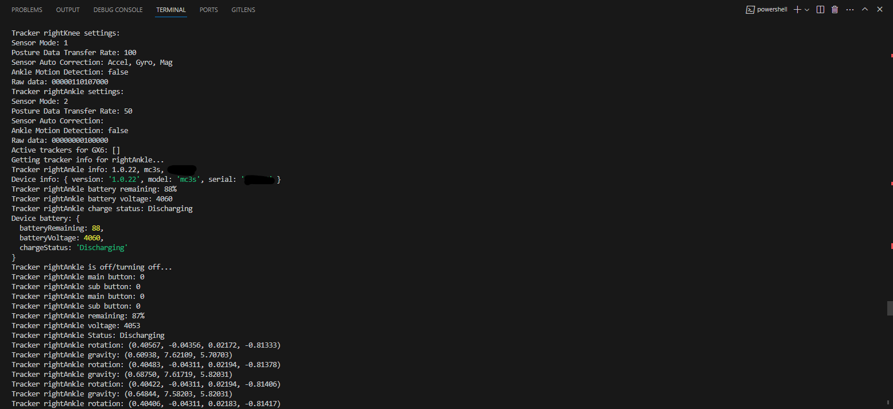

# HaritoraX Interpreter



A node.js package that allows you to communicate and interact with the HaritoraX FBT trackers to interpret the data how you want it. No HaritoraConfigurator software needed!

Check out the Haritora-GX6 proof-of-concept repository here: https://github.com/JovannMC/haritora-gx6-poc

## Installation

`npm install haritorax-interpreter`

## Documentation

Will write actual documentation at some point, for now refer to the source code, JSDoc comments, and example below.

## Supported devices

| Device             | Supported | Elbow/Hip support |
|--------------------|-----------|-------------------|
| HaritoraX Wireless |     Y     |         X         |
| HaritoraX 1.1B     |     X     |         X         |
| HaritoraX 1.1      |     X     |         X         |
| HaritoraX 1.0      |     X     |         X         |
| Haritora           |     X     |         X         |

| Communication mode        | Supported |
|---------------------------|-----------|
| Bluetooth                 |     *     |
| GX6 Communication Dongle  |     Y     |
| GX2 Communication Dongle  |     X     |

**\* partial support**

## Example

```js
import { HaritoraXWireless } from "haritorax-interpreter";

let device = new HaritoraXWireless(true);
device.startConnection("gx6");

device.on("imu", (trackerName, rotation, gravity, ankle) => {
    // IMU data received, do stuff
});

setTimeout(() => {
    // apply the following settings to the rightAnkle tracker:
    // posture data transfer rate: 100FPS
    // sensor mode: 1 (magnetometer enabled)
    // sensor auto correction mode: accelerometer and gyroscope
    // ankle motion detection: enabled
    device.setTrackerSettings("rightAnkle", 100, 1, ['accel', 'gyro'], true);
}, 2000)

setTimeout(() => {
    device.stopConnection("gx6");
}, 10000)
```

## License

This package is licensed under the [MIT](https://opensource.org/license/mit/) License - see the [LICENSE](LICENSE) file for details.
